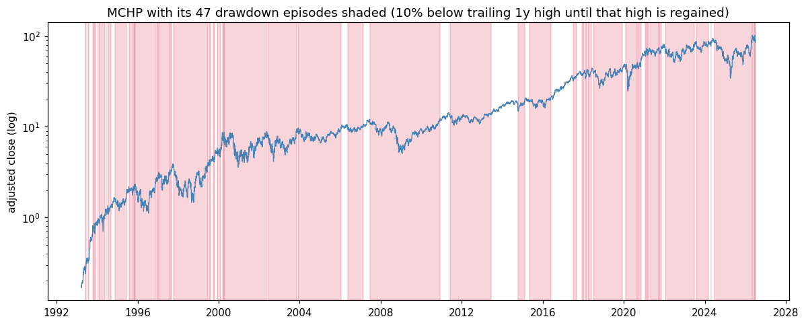
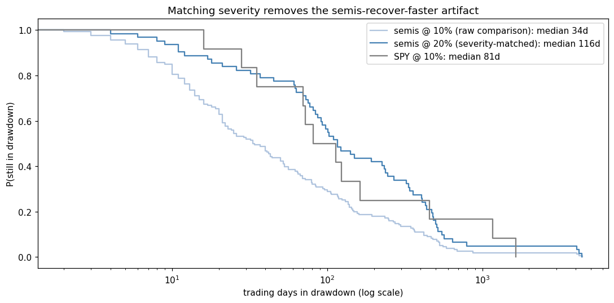
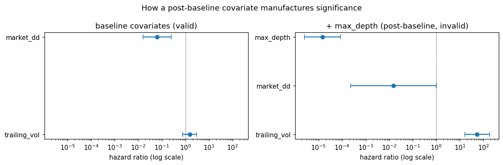

# designwin-survival

📄 **[Report (PDF)](notebooks/designwin-survival-report.pdf)** · 📓 [interactive notebook](notebooks/study.ipynb)

**Applied survival analysis to a financial time-to-event question: implemented
Kaplan-Meier and the log-rank test from scratch (cross-validated against `lifelines`
to 1e-9), extracted right-censored drawdown-recovery episodes from 30 years of
semiconductor price data, and ran clustered Cox regressions — including one
deliberately invalid model that demonstrates how post-baseline covariates manufacture
fake significance.** The motivating research question is design-win revenue timing
(below); the drawdown study is the real-data validation of the machinery, and it
produced one debunked artifact, one honest null, and one robust finding.

## The motivating question

When a semiconductor company (MCHP, NXPI, TXN, ON, ADI) announces a **design win** —
its chip designed into a customer's product — how long until the win appears as
revenue acceleration, and can that hazard be priced? Wins that haven't ramped when
the dataset closes are *right-censored*, which makes survival analysis the correct
tool and naive averaging wrong. Announcements can't be downloaded from an API — they
must be hand-collected from press releases and IR archives — so this repo ships the
tested machinery plus a corpus schema/loader (`designwins.py`, template in `data/`)
ready for that collection step, and validates everything on a question the data does
support today.

## The validation study: how long do semiconductor drawdowns last?

Episodes: close 10% below the trailing 1-year high → episode opens; regain that high
→ recovery (the event); still open at sample end → censored. Five semis + SPY,
1993–2026, 162 + 12 episodes. Full narrative in
[`notebooks/study.ipynb`](notebooks/study.ipynb).



**Finding 1 — an artifact caught red-handed.** Raw comparison: semi drawdowns recover
in a median of 34 trading days vs 81 for SPY. But a 10% move is routine weather at
40–60% vol and a genuine event at SPY's 19% — the threshold means different things.
Severity-matched (semis at 20%), the gap inverts then vanishes: log-rank p ≈ 0.87.
There was no recovery-speed effect, only a threshold-scaling effect:



**Finding 2 — one honest null, one robust result.** In a Cox model with
ticker-clustered errors and *baseline-only* covariates: entry-time volatility
predicts nothing (p ≈ 0.23), while concurrent market stress strongly slows recovery —
roughly **24% lower recovery hazard per 10 points of concurrent SPY drawdown**
(p ≈ 1e-4). Idiosyncratic dips heal fast; systematic ones wait for the market.

**Finding 3 — the trap, sprung on purpose.** Add the episode's eventual maximum depth
as a covariate (information from the episode's *future*) and the model turns
spectacular: the honestly-null volatility covariate becomes the "strongest predictor
in the study" (hazard ratio ≈ 54, p < 1e-4). Every such number is meaningless — the
model conditions on the outcome. This is the survival-analysis version of lookahead
bias, demonstrated so it's recognisable before the design-win corpus arrives:



## What's implemented

| Piece | Details | Validated by |
|---|---|---|
| `kaplan_meier.py` | KM from scratch: survival curve, Greenwood SEs, medians, censoring | Hand-computed example; matches `lifelines` to 1e-10 on randomised inputs |
| `logrank.py` | Two-sample log-rank from scratch | Matches `lifelines` statistic and p-value to 1e-9 |
| `drawdowns.py` | Price series → right-censored episodes with baseline covariates | Constructed paths with hand-known episodes, censoring, depths |
| `designwins.py` | Corpus schema, loud validation, survival-table conversion | Schema/round-trip tests incl. censoring at `as_of` |
| Cox regressions | Via `lifelines`, ticker-clustered errors | The valid/invalid contrast is the exhibit |

## Usage

```python
from survivalsemi import KaplanMeier
from survivalsemi.data import load_prices
from survivalsemi.drawdowns import extract_episodes
from survivalsemi.logrank import logrank_test

close = load_prices("MCHP")
episodes = extract_episodes(close, threshold=0.10, window=252)
km = KaplanMeier.fit(episodes.duration_days, episodes.recovered)
km.median(), km.survival_at(63)          # median recovery, P(still down after a quarter)
```

```bash
pip install -e ".[dev]"
pytest                                  # 30 tests
jupyter notebook notebooks/study.ipynb  # re-runs the study (downloads prices once)
```

## Limitations / what I'd do next

- **The episode definition is one choice among many.** 10%/1-year-high is arbitrary;
  the severity-matched re-run is the mitigation, not the cure. A vol-normalised
  threshold per name would be cleaner.
- **Cross-sectional dependence.** 2008 hits all five names at once; clustering by
  ticker is a partial fix. Calendar-time bootstrap would be the thorough answer.
- **Five tickers** is a universe chosen for the design-win follow-on, not for power.
  SOX constituents would give the Cox model room to breathe.
- **The headline question still needs its data.** Hand-collecting ~50 design-win
  announcements (with revenue-event dates from subsequent earnings calls) is the next
  concrete step; the analysis then runs unchanged via `designwins.to_survival_table`.
- A parametric layer (Weibull/AFT) to compare against the nonparametric curves.
